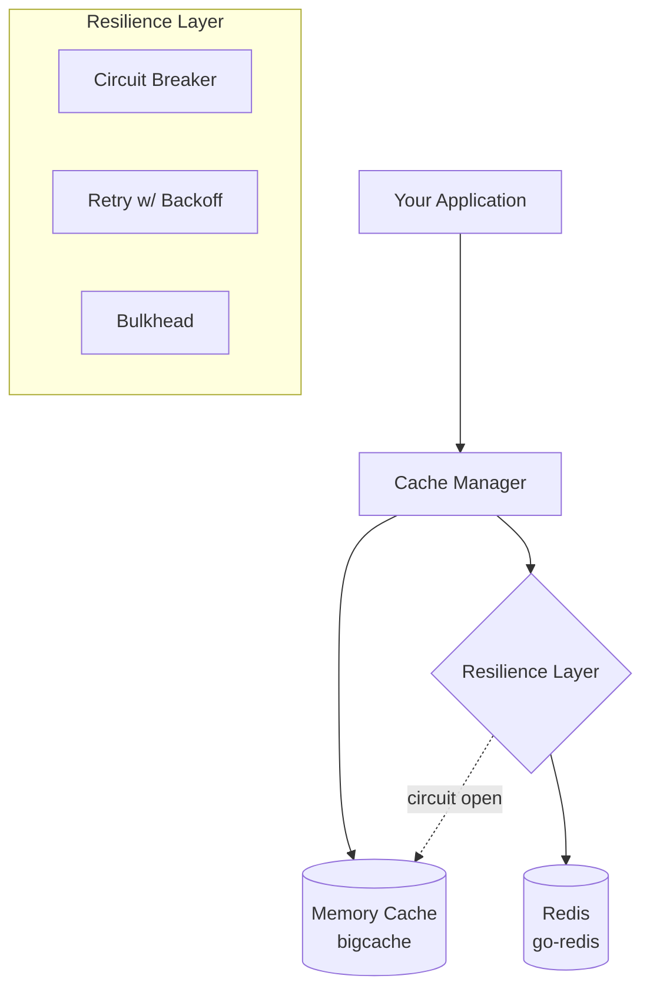

# rentfree

[](https://go.dev/)
[](https://pkg.go.dev/github.com/LavishGent/rentfree)
[](LICENSE)
[](https://goreportcard.com/report/github.com/LavishGent/rentfree)
[](https://github.com/LavishGent/rentfree/actions)
[](https://codecov.io/gh/LavishGent/rentfree)

A multi-layer caching library for Go applications with minimal dependencies. **⚠️ Work in Progress** - Not yet recommended for production use.

## Features

- **Unified API** - Single interface for all caching operations
- **Multi-backend Support** - In-memory (bigcache) and Redis with intelligent fallback
- **Resilience Patterns** - Custom circuit breaker, retry with exponential backoff, and bulkhead
- **Observability** - Metrics tracking with pluggable publishers (logging, custom)
- **Graceful Degradation** - Continues working when Redis fails, falling back to memory cache
- **Cache-Aside Pattern** - Built-in `GetOrCreate` for lazy loading with factory functions
- **Minimal Dependencies** - Only bigcache and go-redis, no external config or metrics frameworks

## Architecture



When Redis goes down, the circuit breaker opens and traffic falls back to memory-only until Redis recovers.

## Cache Levels

| Level | Memory | Redis | Use Case |
|-------|--------|-------|----------|
| `MemoryOnly` | Yes | No | High-frequency reads, session data |
| `RedisOnly` | No | Yes | Shared state across instances |
| `MemoryThenRedis` | Yes (L1) | Yes (L2) | Optimal performance with distribution |
| `All` | Yes | Yes | Maximum availability |

**Note:** Memory cache (bigcache) uses a global TTL (LifeWindow) for all entries. Per-entry TTL via `WithTTL()` only applies to the Redis layer. When using `MemoryOnly` mode, all entries will expire based on the configured `defaultTTL` in the memory config.

## Quick Start

### Installation

```bash
go get github.com/LavishGent/rentfree
```

### Basic Usage

```go
package main

import (
    "context"
    "fmt"

    "github.com/LavishGent/rentfree/pkg/rentfree"
)

type User struct {
    ID   string
    Name string
}

func main() {
    // Create cache manager with defaults (memory-only)
    manager, err := rentfree.New()
    if err != nil {
        panic(err)
    }
    defer manager.Close()

    ctx := context.Background()

    // Simple set/get
    user := User{ID: "123", Name: "Alice"}
    _ = manager.Set(ctx, "user:123", user)

    var cached User
    _ = manager.Get(ctx, "user:123", &cached)
    fmt.Printf("Got user: %+v\n", cached)

    // Cache-aside pattern with factory
    var result User
    _ = manager.GetOrCreate(ctx, "user:456", &result, func() (any, error) {
        // This only runs on cache miss
        return User{ID: "456", Name: "Bob"}, nil
    })
}
```

### With Redis

```go
// Load from config file with environment variable overrides
manager, err := rentfree.NewFromFile("config.json")

// Or configure programmatically
cfg := rentfree.Config()
cfg.Redis.Enabled = true
cfg.Redis.Address = "localhost:6379"
manager, err := rentfree.NewFromConfig(cfg)

// Or use functional options
manager, err := rentfree.New(
    rentfree.WithRedisAddress("localhost:6379"),
)
```

## Configuration

Configuration is loaded from JSON files with environment variable overrides:

```json
{
  "memory": {
    "enabled": true,
    "maxSizeMB": 256,
    "defaultTTL": "5m",
    "cleanupInterval": "10s",
    "shards": 1024,
    "maxEntrySize": 10485760
  },
  "redis": {
    "enabled": true,
    "address": "localhost:6379",
    "password": "",
    "db": 0,
    "keyPrefix": "rentfree:",
    "defaultTTL": "15m",
    "poolSize": 100
  },
  "circuitBreaker": {
    "enabled": true,
    "failureThreshold": 5,
    "successThreshold": 2,
    "openDuration": "30s",
    "halfOpenMaxRequests": 3
  },
  "retry": {
    "enabled": true,
    "maxAttempts": 3,
    "initialBackoff": "100ms",
    "maxBackoff": "2s",
    "multiplier": 2.0,
    "jitter": true
  },
  "bulkhead": {
    "enabled": true,
    "maxConcurrent": 100,
    "maxQueue": 50,
    "acquireTimeout": "100ms"
  },
  "metrics": {
    "enabled": true,
    "publishInterval": "10s"
  }
}
```

Environment variables override JSON values (prefix: `RENTFREE_`):

```bash
export RENTFREE_REDIS_ADDRESS="redis.prod.internal:6379"
export RENTFREE_REDIS_PASSWORD="secret"
export RENTFREE_REDIS_ENABLED="true"
export RENTFREE_BULKHEAD_MAX_CONCURRENT="200"
```

## Project Structure

```text
rentfree/
├── examples/
│   └── basic/              # Example application
├── internal/
│   ├── cache/              # Cache implementations (memory, redis, manager)
│   ├── config/             # Configuration loading and validation
│   ├── metrics/            # Metrics tracking and publishing
│   ├── resilience/         # Circuit breaker, retry, bulkhead
│   └── types/              # Shared types and errors
├── pkg/
│   └── rentfree/           # Public API types
├── go.mod
├── go.sum
└── README.md
```

## Dependencies

| Library | Purpose |
|---------|---------|
| `allegro/bigcache/v3` | Zero-GC in-memory cache |
| `redis/go-redis/v9` | Redis client |

No external dependencies for configuration, circuit breaker, or metrics - all implemented in-house using the Go standard library.

## Metrics

The library tracks the following metrics internally:

| Metric | Type | Description |
|--------|------|-------------|
| Memory/Redis Hits | Counter | Cache hit count by layer |
| Memory/Redis Misses | Counter | Cache miss count by layer |
| Get/Set/Delete Count | Counter | Operation counts |
| Error Count | Counter | Total error count |
| Latency Percentiles | Gauge | p50, p95, p99 latency |

Metrics can be published via:
- `LoggingPublisher` - Logs metrics using `slog`
- `NoOpPublisher` - For testing
- Custom publishers implementing `MetricsPublisher` interface

## Test Coverage

| Package | Coverage |
|---------|----------|
| `internal/config` | 97.5% |
| `internal/metrics` | 92.6% |
| `internal/resilience` | 90.1% |
| `internal/cache` | 53.8% |
| `internal/types` | 64.9% |

## Requirements

- Go 1.21+ (for `log/slog` and latest generics)
- Redis (optional, for distributed caching)

## Development

### Running Redis for Testing

Start a Redis instance using Docker (use `linux/arm64` for Apple Silicon Macs, `linux/amd64` for Intel):

```bash
docker run -d -p 6379:6379 --platform linux/arm64 redis:alpine
```

### Running Tests

```bash
# Run all tests
go test ./...

# Run tests with verbose output
go test ./... -v

# Run tests with coverage
go test ./... -cover

# Run Redis integration tests (requires Redis)
go test ./internal/cache/... -v -run "Redis|Graceful"

# Run benchmarks
go test ./internal/cache/... -bench=. -benchtime=1s -run=^$
```

To use a custom Redis address for tests:

```bash
REDIS_TEST_ADDRESS=localhost:6380 go test ./internal/cache/... -v -run Redis
```

## License

MIT License - See [LICENSE](LICENSE) for details.
